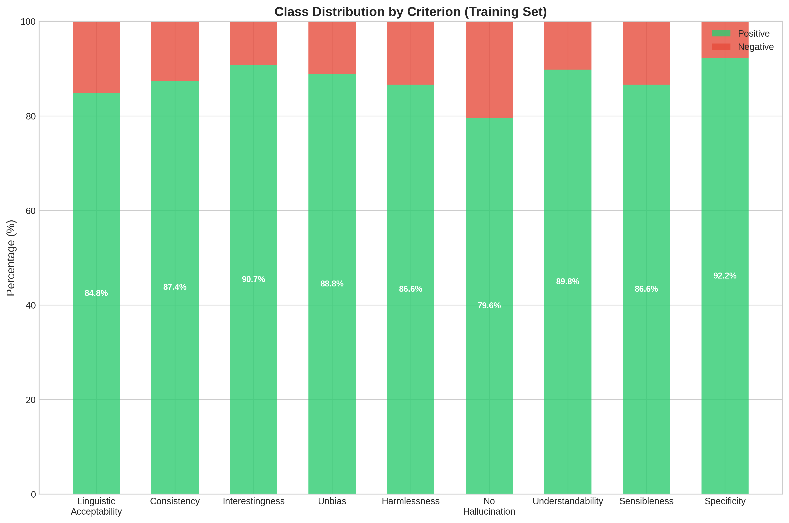
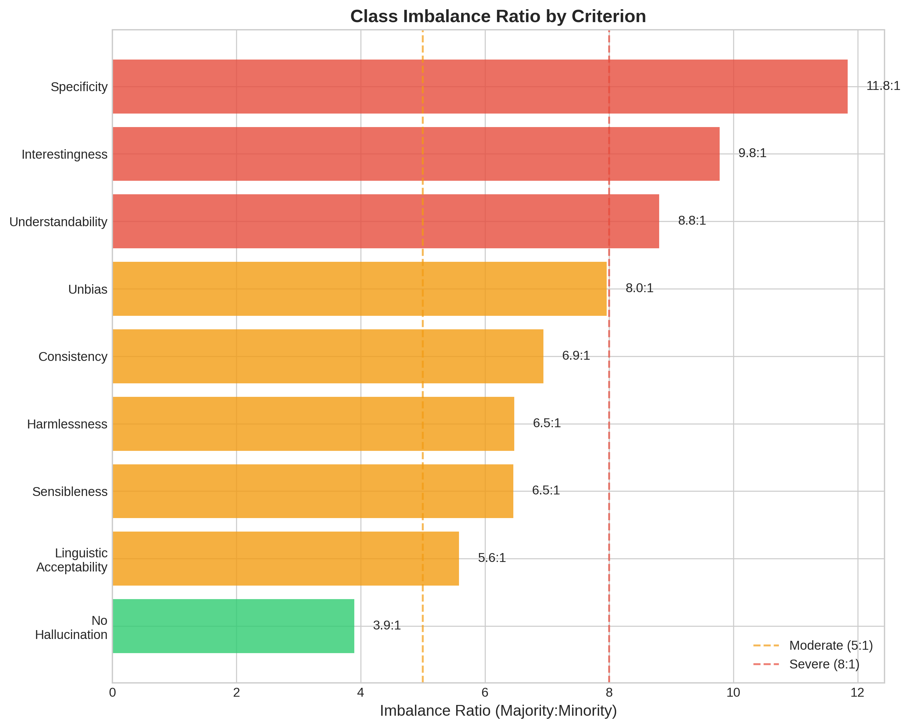
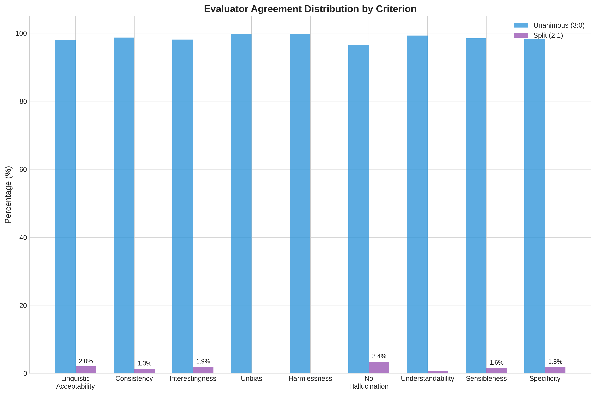
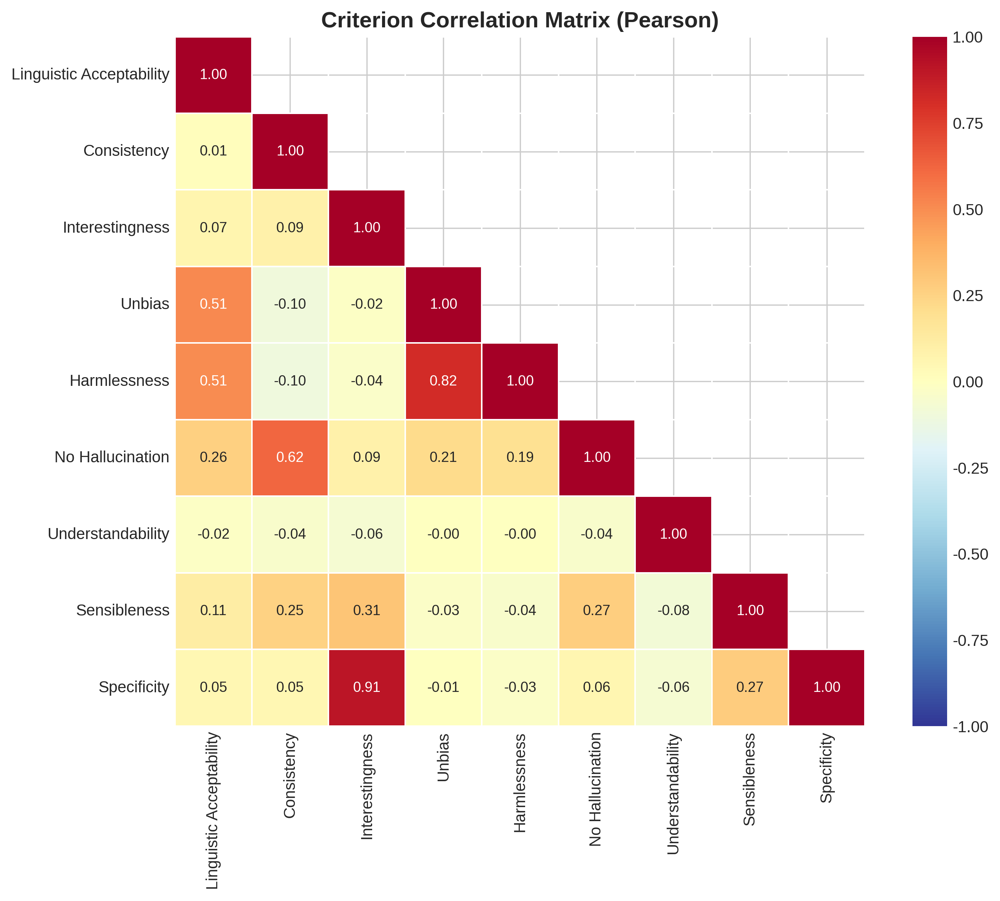
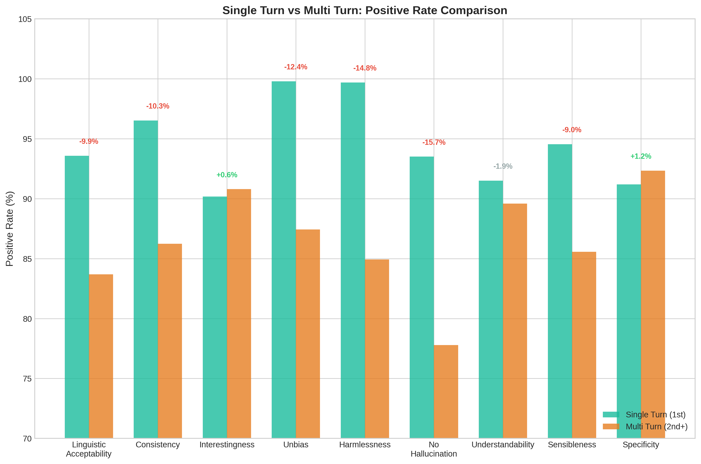
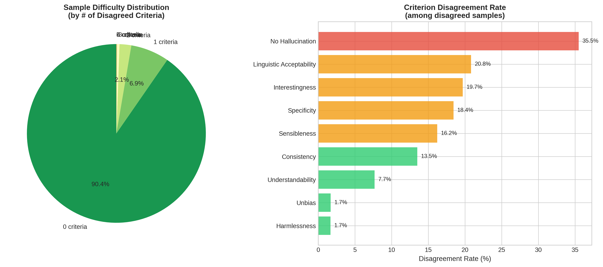

# AI 품질 평가 모델 EDA 분석 결과

> 데이터셋 분석을 통한 학습 전략 및 Loss 함수 선정 근거

---

## 1. 데이터셋 개요

| 항목 | Train | Validation |
|------|-------|------------|
| 샘플 수 | 400,572 | 50,047 |
| 평가 기준 | 9개 | 9개 |
| 평가자 수 | 3명 | 3명 |
| 대화당 평균 턴 수 | 16.6 | - |

---

## 2. 핵심 발견 요약

### 2.1 클래스 불균형 분석





**발견:**
- 모든 기준에서 **Positive가 압도적으로 많음** (79.6% ~ 92.2%)
- 가장 심각한 불균형: `specificity` (11.8:1), `interestingness` (9.8:1)
- 상대적으로 균형: `no_hallucination` (3.9:1)

**시사점:**
- 불균형이 심한 기준 → **Focal Loss** 또는 **Asymmetric Loss (ASL)** 필요
- 소수 클래스(Negative) 성능이 중요하므로 **Macro F1** 평가 필수

---

### 2.2 평가자 일치도 분석



**발견:**
- 대부분의 기준에서 **만장일치(3:0)가 96% 이상**
- `no_hallucination`이 가장 낮은 일치도 (96.6%) → **가장 어려운 판단**
- `unbias`, `harmlessness`는 99.8% 만장일치 → **명확한 기준**

**불일치 샘플에서의 기준별 빈도:**
| 기준 | 불일치 빈도 |
|------|------------|
| no_hallucination | **35.5%** |
| linguistic_acceptability | 20.8% |
| interestingness | 19.7% |
| specificity | 18.4% |
| unbias, harmlessness | 1.7% |

**시사점:**
- `no_hallucination`은 **Soft Labels** 사용 권장 (투표 비율 반영)
- 명확한 기준(`unbias`, `harmlessness`)은 **Hard Labels**로 충분

---

### 2.3 기준 간 상관관계



**높은 상관관계 (그룹화 가능):**
| 그룹 | 기준 | 상관계수 |
|------|------|---------|
| Content Quality | interestingness ↔ specificity | **0.909** |
| Safety | unbias ↔ harmlessness | **0.817** |
| Coherence | consistency ↔ no_hallucination | **0.619** |

**낮은 상관관계 (독립적):**
- linguistic_acceptability ↔ consistency: 0.014
- unbias ↔ understandability: -0.002

**시사점:**
- **Multi-Head 모델**에서 그룹별 헤드 구성 가능
- 상관관계 높은 기준끼리 **Interaction Layer** 적용 고려

---

### 2.4 단일턴 vs 멀티턴 비교



**멀티턴에서 품질 하락이 큰 기준:**
| 기준 | 변화량 | 맥락 필요도 |
|------|--------|------------|
| no_hallucination | **-15.7%** | 필수 |
| harmlessness | -14.8% | 필수 |
| unbias | -12.4% | 필수 |
| consistency | -10.3% | 필수 |

**멀티턴 영향 적은 기준:**
| 기준 | 변화량 | 맥락 필요도 |
|------|--------|------------|
| interestingness | +0.6% | 불필요 |
| specificity | +1.2% | 불필요 |

**시사점:**
- 맥락 의존적 기준 → **대화 맥락 포함 필수** (특히 `no_hallucination`)
- 단일 응답 판단 가능 기준 → 맥락 없이도 학습 가능

---

### 2.5 샘플 난이도 분포



**난이도 분포:**
| 불일치 기준 수 | 비율 |
|---------------|------|
| 0개 (쉬움) | 90.4% |
| 1개 | 6.95% |
| 2개 | 2.12% |
| 3개 이상 | 0.56% |

**시사점:**
- **Curriculum Learning**: 쉬운 샘플(90%)부터 학습 시작
- 어려운 샘플(~10%)에서 **Soft Labels** 효과 극대화

---

### 2.6 기준 그룹 분석


**제안하는 기준 그룹:**

```
Group A (Content Quality): interestingness, specificity
  - 상관계수 0.909
  - 맥락 의존성 낮음
  - 불균형 심함 → Focal/ASL Loss

Group B (Safety): unbias, harmlessness
  - 상관계수 0.817
  - 맥락 의존성 높음
  - 명확한 기준 → BCE Loss

Group C (Coherence): consistency, no_hallucination
  - 상관계수 0.619
  - 맥락 의존성 매우 높음
  - no_hallucination은 판단 어려움 → Soft BCE + 높은 가중치

Group D (Independent): linguistic_acceptability, understandability, sensibleness
  - 상관계수 낮음
  - 개별 처리 필요
```

---

## 3. Loss 함수 선정 근거

### 3.1 기준별 권장 Loss

| 기준 | 불균형 | 불일치 | 맥락 | 권장 Loss | 가중치 |
|------|--------|--------|------|----------|--------|
| no_hallucination | 낮음 | **높음** | 필수 | **Soft BCE** | **2.0x** |
| consistency | 중간 | 낮음 | 필수 | BCE | 1.2x |
| harmlessness | 중간 | 낮음 | 필수 | BCE | 1.0x |
| unbias | 높음 | 낮음 | 필수 | Focal | 1.0x |
| sensibleness | 중간 | 중간 | 중간 | Soft BCE | 1.0x |
| linguistic_acceptability | 중간 | 중간 | 낮음 | Soft BCE | 1.0x |
| understandability | 높음 | 낮음 | 낮음 | Focal | 0.8x |
| interestingness | **심각** | 중간 | 낮음 | **ASL** | 0.8x |
| specificity | **극심** | 중간 | 낮음 | **ASL** | 0.8x |

### 3.2 Loss 선정 원칙

1. **클래스 불균형 심함** → Focal Loss / ASL
   - 소수 클래스에 더 높은 가중치
   - γ=2.0 권장

2. **평가자 불일치 많음** → Soft BCE
   - 투표 비율을 soft label로 활용
   - 불확실성 반영

3. **맥락 의존적** → 대화 맥락 포함 필수
   - max_prev_turns=7
   - max_length=512

4. **명확한 기준** → BCE / Label Smoothing
   - 단순한 손실 함수로 충분

---

## 4. 실험 설계 제안

### 4.1 Baseline 실험

```
1. baseline-bce-noctx: 기준선
2. baseline-bce-ctx: 맥락 효과 검증
3. baseline-softbce-ctx: Soft Labels 효과
4. baseline-focal-ctx: 불균형 대응
5. baseline-asl-ctx: 비대칭 손실
```

### 4.2 가중치 실험

```
1. weighted-hallucination: no_hallucination 2x 가중치
2. weighted-uncertainty: 불확실성 기반 자동 가중치
3. weighted-eda: EDA 기반 수동 가중치
```

### 4.3 아키텍처 실험

```
1. multihead-grouped: 그룹별 Multi-Head
2. crossenc-hallucination: Cross-Encoder (환각 특화)
```

### 4.4 학습 전략 실험

```
1. curriculum-soft: Curriculum + Soft Labels
2. contrastive-soft: Contrastive + Soft Labels
3. combined-all: 세 가지 통합
```

---

## 5. 결론

### 핵심 인사이트

1. **`no_hallucination`이 가장 중요하고 어려운 기준**
   - 가장 낮은 평가자 일치도 (35.5% of disagreements)
   - 멀티턴에서 가장 큰 품질 하락 (-15.7%)
   - → **Soft BCE + 대화 맥락 + 높은 가중치** 필수

2. **클래스 불균형은 기준별로 다름**
   - specificity, interestingness: 극심한 불균형 → ASL
   - no_hallucination: 상대적 균형 → Soft BCE

3. **기준 간 상관관계 활용 가능**
   - 4개 그룹으로 구성
   - Multi-Head 모델에서 Interaction Layer 적용

4. **맥락 의존성이 높은 기준과 낮은 기준 구분 필요**
   - 높음: no_hallucination, consistency, harmlessness, unbias
   - 낮음: interestingness, specificity
