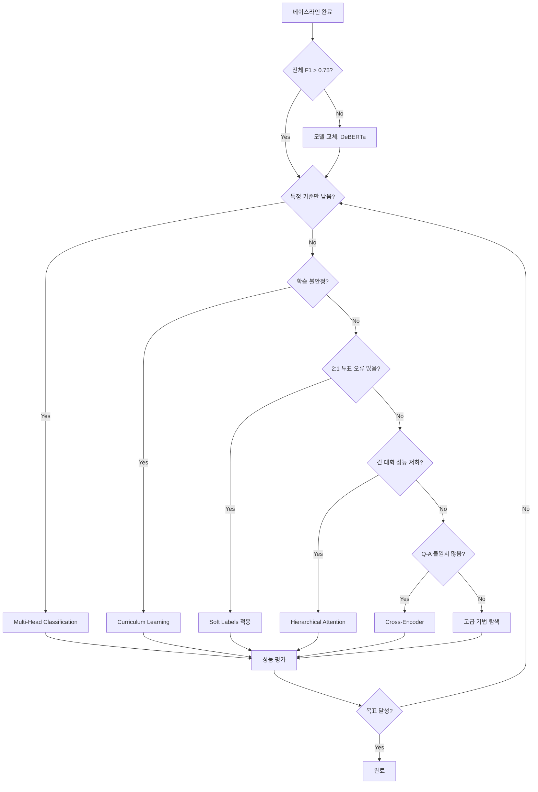
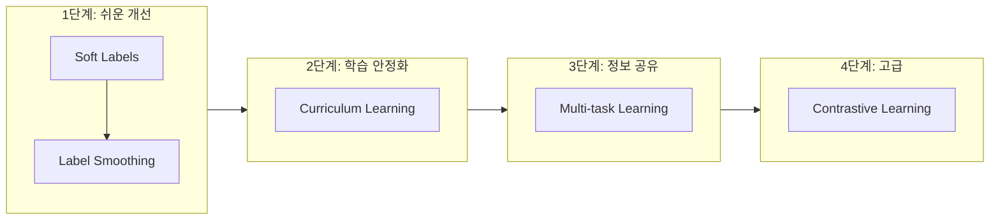
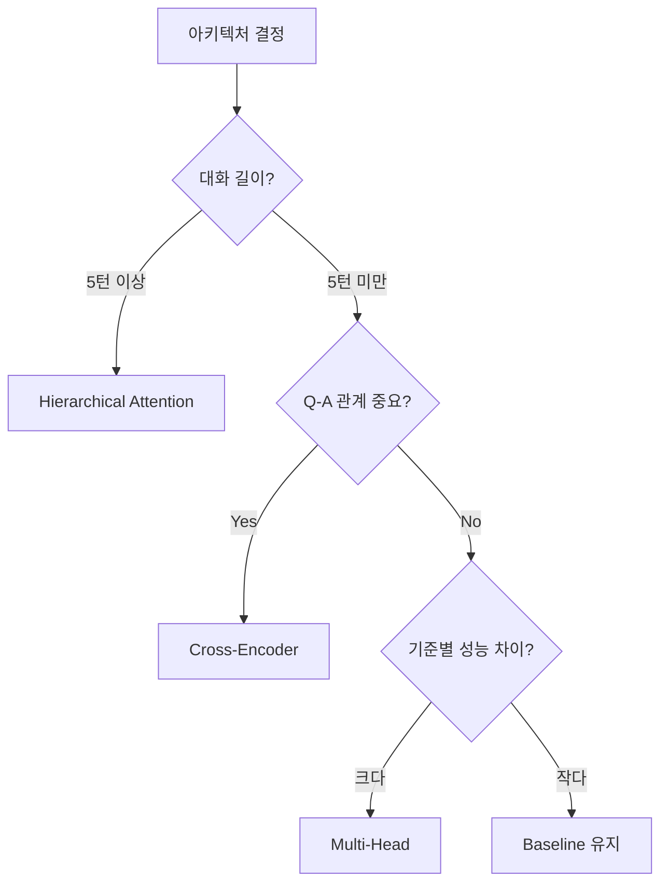

# 의사결정 가이드: 학습 기법 & 아키텍처 선택

> 모델 성능 개선을 위한 사고 흐름 가이드
>
> "어떤 기법을 언제, 왜, 어떤 순서로 적용해야 하는가?"

---

## 목차

1. [시작하기 전에](#1-시작하기-전에)
2. [문제 진단 체크리스트](#2-문제-진단-체크리스트)
3. [의사결정 플로우차트](#3-의사결정-플로우차트)
4. [상황별 적용 가이드](#4-상황별-적용-가이드)
5. [기법 조합 전략](#5-기법-조합-전략)
6. [트러블슈팅](#6-트러블슈팅)

---

## 1. 시작하기 전에

### 핵심 원칙

```
1. 베이스라인 먼저
   → 단순한 모델로 기준점 확보
   → 복잡한 기법은 그 이후

2. 한 번에 하나씩
   → 여러 기법 동시 적용 ✗
   → A/B 테스트로 효과 측정

3. 데이터 기반 결정
   → "느낌"이 아닌 "지표"로 판단
   → 어떤 기준에서 실패하는지 분석
```

### 필수 준비물

| 항목 | 설명 | 확인 |
|------|------|:----:|
| 베이스라인 모델 | `01_implementation_strategy.md` 기반 | □ |
| 검증 데이터셋 | Training/Validation 분리 | □ |
| 기준별 성능 | 9개 기준 각각의 F1 score | □ |
| 에러 분석 | 오분류 샘플 수집 | □ |

---

## 2. 문제 진단 체크리스트

### Step 1: 전체 성능 확인

```python
# 베이스라인 성능 측정
from sklearn.metrics import f1_score, classification_report

# 기준별 F1 계산
for i, criterion in enumerate(CRITERIA):
    f1 = f1_score(y_true[:, i], y_pred[:, i])
    print(f"{criterion}: {f1:.4f}")
```

### Step 2: 문제 유형 파악

다음 질문에 답하세요:

| 질문 | 예 → 해결책 |
|------|------------|
| 전체적으로 성능이 낮은가? (F1 < 0.7) | 모델 교체 (DeBERTa) |
| 특정 기준만 낮은가? | Multi-Head Classification |
| 학습 loss가 불안정한가? | Curriculum Learning |
| 2:1 투표 샘플에서 많이 틀리는가? | Soft Labels |
| 긴 대화에서 성능이 떨어지는가? | Hierarchical Attention |
| Q-A 불일치 (환각)가 많은가? | Cross-Encoder |

### Step 3: 분석 코드

```python
def diagnose_model(y_true, y_pred, vote_ratios, text_lengths):
    """모델 문제점 진단"""
    
    results = {}
    
    # 1. 기준별 성능
    for i, criterion in enumerate(CRITERIA):
        results[criterion] = f1_score(y_true[:, i], y_pred[:, i])
    
    # 2. 투표 비율별 성능
    easy_mask = vote_ratios == 1.0  # 만장일치
    hard_mask = vote_ratios < 0.8   # 2:1 이하
    
    results['easy_f1'] = f1_score(y_true[easy_mask], y_pred[easy_mask], average='macro')
    results['hard_f1'] = f1_score(y_true[hard_mask], y_pred[hard_mask], average='macro')
    
    # 3. 텍스트 길이별 성능
    short_mask = text_lengths < 100
    long_mask = text_lengths > 300
    
    results['short_f1'] = f1_score(y_true[short_mask], y_pred[short_mask], average='macro')
    results['long_f1'] = f1_score(y_true[long_mask], y_pred[long_mask], average='macro')
    
    return results

# 결과 해석
diagnosis = diagnose_model(y_true, y_pred, vote_ratios, text_lengths)

print("=== 진단 결과 ===")
if diagnosis['hard_f1'] < diagnosis['easy_f1'] - 0.1:
    print("⚠️ 어려운 샘플(2:1 투표)에서 성능 저하 → Soft Labels 추천")
    
if diagnosis['long_f1'] < diagnosis['short_f1'] - 0.1:
    print("⚠️ 긴 텍스트에서 성능 저하 → Hierarchical Attention 추천")
    
low_criteria = [k for k, v in diagnosis.items() if k in CRITERIA and v < 0.7]
if low_criteria:
    print(f"⚠️ 낮은 기준: {low_criteria} → Multi-Head Classification 추천")
```

---

## 3. 의사결정 플로우차트

### 전체 흐름



### 학습 기법 선택 흐름



### 아키텍처 선택 흐름



---

## 4. 상황별 적용 가이드

### 상황 1: "전체적으로 성능이 낮다" (F1 < 0.70)

```
원인 분석:
  - 모델 표현력 부족
  - 데이터 불균형
  - 입력 형식 문제

해결 순서:
  1. 입력 형식 확인 (Context + Response 분리)
  2. 모델 교체: KLUE-RoBERTa → DeBERTa-v3
  3. 클래스 불균형 처리 (Weighted Loss)

코드:
```

```python
# 1. 입력 형식 개선
def format_input(context, response):
    return f"[Context] {context} [Response] {response}"

# 2. 모델 교체
from transformers import AutoModelForSequenceClassification

model = AutoModelForSequenceClassification.from_pretrained(
    'microsoft/deberta-v3-base',  # 더 강력한 모델
    num_labels=9,
    problem_type='multi_label_classification'
)

# 3. Weighted Loss
pos_weight = (num_negative / num_positive).to(device)
criterion = nn.BCEWithLogitsLoss(pos_weight=pos_weight)
```

---

### 상황 2: "특정 기준만 성능이 낮다"

```
예시:
  - interestingness: 0.55 (낮음)
  - no_hallucination: 0.60 (낮음)
  - 나머지: 0.80+ (양호)

원인:
  - 기준별 특성 차이
  - 공유 표현이 특정 기준에 최적화되지 않음

해결:
  → Multi-Head Classification
```

```python
# 기준 그룹화
CRITERION_GROUPS = {
    'language': ['linguistic_acceptability', 'understandability'],
    'content': ['consistency', 'sensibleness', 'specificity'],
    'safety': ['unbias', 'harmlessness', 'no_hallucination'],
    'engagement': ['interestingness']
}

# Multi-Head 적용
# → refer/architectures/multihead_classification.md 참조
```

---

### 상황 3: "학습이 불안정하다" (loss 진동)

```
증상:
  - Loss가 수렴하지 않고 진동
  - Validation 성능 불안정
  - 특정 epoch에서 급격한 성능 저하

원인:
  - 어려운 샘플이 학습 초기에 혼란 유발
  - Learning rate 문제

해결:
  1. Learning rate 낮추기 (2e-5 → 1e-5)
  2. Warmup 증가 (0.1 → 0.2)
  3. Curriculum Learning 적용
```

```python
# Curriculum Learning
# 쉬운 샘플(만장일치) → 어려운 샘플(2:1) 순서로 학습

def get_difficulty(vote_ratio):
    if vote_ratio >= 1.0:  # 만장일치
        return 'easy'
    elif vote_ratio >= 0.8:  # 4:1 이상
        return 'medium'
    else:  # 2:1 이하
        return 'hard'

# Phase 1: Easy samples only
# Phase 2: Easy + Medium
# Phase 3: All samples

# → refer/learning_techniques/curriculum_learning.md 참조
```

---

### 상황 4: "2:1 투표 샘플에서 오류가 많다"

```
증상:
  - 만장일치 샘플: F1 0.85
  - 2:1 투표 샘플: F1 0.65

원인:
  - Hard label이 불확실성 무시
  - 모델이 "확실한 것"만 학습

해결:
  → Soft Labels 적용
```

```python
# Hard Label (기존)
label = 1 if yes_count > no_count else 0  # 2:1 → 1

# Soft Label (개선)
soft_label = yes_count / total_count  # 2:1 → 0.67

# Soft BCE Loss
def soft_bce_loss(logits, soft_labels):
    probs = torch.sigmoid(logits)
    loss = -soft_labels * torch.log(probs + 1e-8) \
           -(1 - soft_labels) * torch.log(1 - probs + 1e-8)
    return loss.mean()

# → refer/learning_techniques/uncertainty_modeling.md 참조
```

---

### 상황 5: "긴 대화에서 성능이 떨어진다"

```
증상:
  - 1-2턴 대화: F1 0.82
  - 5턴+ 대화: F1 0.68

원인:
  - 긴 입력 → 토큰 truncation
  - 중요 정보가 잘림

해결:
  1. max_length 증가 (256 → 512)
  2. Hierarchical Attention 적용
```

```python
# Hierarchical Attention
# 각 턴을 독립 인코딩 → 턴 레벨 어텐션

# 장점:
#   - 긴 대화도 처리 가능
#   - 어느 턴이 중요한지 해석 가능

# → refer/architectures/hierarchical_attention.md 참조
```

---

### 상황 6: "no_hallucination 기준이 특히 낮다"

```
증상:
  - no_hallucination: 0.58
  - 응답이 질문과 맞지 않는 경우 탐지 실패

원인:
  - Q-A 대응관계 학습 부족
  - Context-Response 상호작용 모델링 부재

해결:
  → Cross-Encoder 적용
```

```python
# Cross-Encoder
# Context와 Response를 Cross-Attention으로 상호작용

# 입력: [CLS] Context [SEP] Response [SEP]
# → Context-Response 토큰 간 어텐션 학습

# → refer/architectures/cross_encoder.md 참조
```

---

## 5. 기법 조합 전략

### 효과적인 조합

| 조합 | 시너지 | 추천 상황 |
|------|--------|----------|
| Soft Labels + Curriculum | 불확실성 반영 + 안정적 학습 | 일반적으로 추천 |
| Multi-Head + Multi-task | 기준별 특화 + 정보 공유 | 기준 간 성능 편차 클 때 |
| Cross-Encoder + Soft Labels | Q-A 관계 + 불확실성 | no_hallucination 낮을 때 |

### 적용 순서 (권장)

```
Stage 1: 데이터 레벨
├── Soft Labels 계산
└── 난이도 분류 (Easy/Medium/Hard)

Stage 2: 학습 기법
├── Soft BCE Loss 적용
└── (선택) Curriculum Learning

Stage 3: 아키텍처
├── 문제에 맞는 아키텍처 선택
└── 하나씩 실험

Stage 4: 고급 기법
├── Contrastive Learning
└── Multi-task Learning
```

### 피해야 할 조합

| 조합 | 문제점 |
|------|--------|
| Curriculum + Contrastive (동시) | 둘 다 배치 구성 변경 → 충돌 |
| 여러 아키텍처 동시 적용 | 복잡도 증가, 디버깅 어려움 |
| 최적화 없이 대형 모델 | 메모리 부족, 학습 불가 |

---

## 6. 트러블슈팅

### 문제: CUDA Out of Memory

```python
# 해결 1: Batch size 줄이기
batch_size = 8  # 16 → 8

# 해결 2: Gradient Accumulation
accumulation_steps = 4
loss = loss / accumulation_steps
loss.backward()
if (step + 1) % accumulation_steps == 0:
    optimizer.step()
    optimizer.zero_grad()

# 해결 3: Mixed Precision
from torch.cuda.amp import autocast, GradScaler
scaler = GradScaler()

with autocast():
    logits = model(input_ids, attention_mask)
    loss = criterion(logits, labels)

scaler.scale(loss).backward()
scaler.step(optimizer)
scaler.update()
```

### 문제: 학습이 수렴하지 않음

```python
# 체크리스트:
# 1. Learning rate 확인 (1e-5 ~ 3e-5)
# 2. Warmup ratio 확인 (0.1 ~ 0.2)
# 3. 데이터 셔플 확인
# 4. 라벨 인코딩 확인

# Learning rate 스케줄러
from transformers import get_linear_schedule_with_warmup

total_steps = len(train_loader) * epochs
warmup_steps = int(total_steps * 0.1)

scheduler = get_linear_schedule_with_warmup(
    optimizer,
    num_warmup_steps=warmup_steps,
    num_training_steps=total_steps
)
```

### 문제: Validation 성능이 Training보다 훨씬 낮음

```python
# 과적합 징후
# 해결:
# 1. Dropout 증가
model.config.hidden_dropout_prob = 0.2  # 기본 0.1

# 2. Weight Decay 적용
optimizer = AdamW(model.parameters(), lr=2e-5, weight_decay=0.01)

# 3. Early Stopping
best_val_loss = float('inf')
patience = 3
patience_counter = 0

for epoch in range(epochs):
    val_loss = validate(model, val_loader)
    if val_loss < best_val_loss:
        best_val_loss = val_loss
        patience_counter = 0
        torch.save(model.state_dict(), 'best_model.pt')
    else:
        patience_counter += 1
        if patience_counter >= patience:
            print("Early stopping!")
            break
```

### 문제: 특정 기준의 Recall이 0

```python
# 클래스 불균형 문제
# 해결 1: Positive weight
pos_count = (labels == 1).sum(dim=0)
neg_count = (labels == 0).sum(dim=0)
pos_weight = neg_count / (pos_count + 1e-8)

criterion = nn.BCEWithLogitsLoss(pos_weight=pos_weight)

# 해결 2: Focal Loss
class FocalLoss(nn.Module):
    def __init__(self, gamma=2.0):
        super().__init__()
        self.gamma = gamma
    
    def forward(self, logits, labels):
        probs = torch.sigmoid(logits)
        pt = labels * probs + (1 - labels) * (1 - probs)
        focal_weight = (1 - pt) ** self.gamma
        bce = F.binary_cross_entropy_with_logits(logits, labels, reduction='none')
        return (focal_weight * bce).mean()
```

---

## 빠른 참조 테이블

| 증상 | 진단 | 해결책 | 문서 |
|------|------|--------|------|
| 전체 F1 < 0.70 | 모델 능력 부족 | DeBERTa 교체 | [모델 비교](01_model_comparison.md) |
| 특정 기준 낮음 | 기준별 특성 차이 | Multi-Head | [아키텍처](architectures/multihead_classification.md) |
| 학습 불안정 | 어려운 샘플 영향 | Curriculum | [학습 기법](learning_techniques/curriculum_learning.md) |
| 2:1 투표 오류 | 불확실성 무시 | Soft Labels | [학습 기법](learning_techniques/uncertainty_modeling.md) |
| 긴 대화 성능 저하 | 토큰 제한 | Hierarchical | [아키텍처](architectures/hierarchical_attention.md) |
| 환각 탐지 실패 | Q-A 관계 부족 | Cross-Encoder | [아키텍처](architectures/cross_encoder.md) |

---

## 다음 단계

1. **진단 실행**: 위 코드로 현재 모델 진단
2. **기법 선택**: 플로우차트 따라 적절한 기법 선택
3. **구현**: 해당 문서의 코드 참고
4. **실험 기록**: [experiment_template.md](experiment_template.md) 활용
5. **공유**: [team_experiments/](team_experiments/)에 결과 기록
